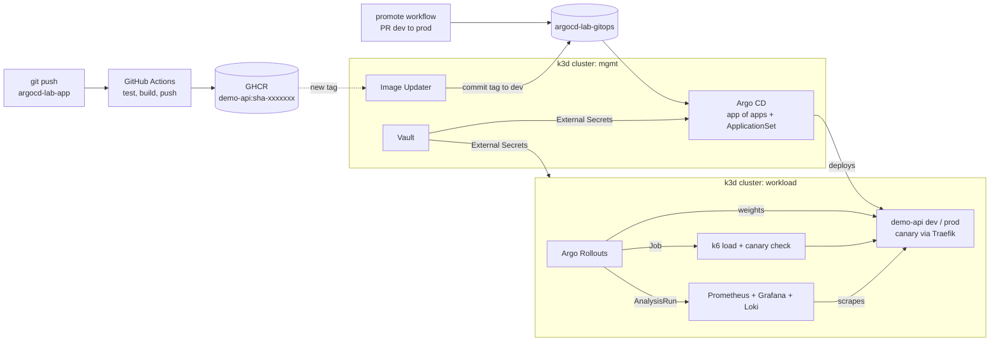

# argocd-lab-gitops

A production-style GitOps platform on two local Kubernetes clusters, run by Argo CD:
promotion by pull request, canary releases with Argo Rollouts, and **automatic rollback when
Prometheus metrics or a k6 load test say the new version is bad**.

Application code and CI: [argocd-lab-app](https://github.com/MykhailoKhil/argocd-lab-app).
CI builds images; this repo decides what runs where.

<!-- Put the demo GIF here: canary at 20% -> analysis fails -> traffic back to stable -->
<!--  -->

## Architecture



## What is in here

| Area | How | Where |
|------|-----|-------|
| Bootstrap | one manual `kubectl apply`, Argo CD then manages itself | `bootstrap/`, `clusters/mgmt/argocd.yaml` |
| Multi-cluster | hub (mgmt) deploys to spoke (workload), cluster Secret built from Vault | `platform/secret-store/mgmt/cluster-workload.yaml` |
| Environments | ApplicationSet (git files generator) + Kustomize overlays | `clusters/mgmt/apps.yaml`, `apps/demo-api/overlays/` |
| TLS | cert-manager, self-signed CA per cluster, Traefik | `platform/cert-manager-issuers/` |
| Secrets | Vault (Raft) + External Secrets Operator; git holds only references | `docs/vault.md` |
| Observability | kube-prometheus-stack, Loki + Alloy, Argo CD metrics and alerts | `clusters/mgmt/kube-prometheus-stack.yaml` |
| CD for dev | Argo CD Image Updater writes new tags back to git | `platform/image-updater/` |
| CD for prod | promote workflow opens a PR; merge = deploy; `validate` must pass | `.github/workflows/` |
| Progressive delivery | Rollout + Traefik weighted canary 20/50/80/100 | `apps/demo-api/base/rollout.yaml`, `traffic.yaml` |
| Automated rollback | background analysis: error rate < 1%, p95 < 300 ms, k6 thresholds on the canary | `apps/demo-api/base/analysis.yaml`, `k6/` |
| Guard rails | sync window (prod weekend freeze), HPA with ignoreDifferences, orphaned resource warnings | `clusters/mgmt/project-apps.yaml` |
| Access | RBAC roles, local "team" account, GitHub SSO via Dex | `docs/t22-t23-access.md` |
| Alerts | Telegram from Argo CD (deployed / failed / degraded) and Rollouts (aborted) | `docs/t24-notifications.md` |

## Release flow

1. Push to `argocd-lab-app` → CI pushes `ghcr.io/mykhailokhil/demo-api:sha-<short>`.
2. Image Updater commits the new tag to `overlays/dev`.
3. Argo CD syncs dev → Rollout starts a canary: 20% → 50% → 80% → 100% of traffic.
4. During the canary: Prometheus checks the canary's error rate and p95 latency every 30 s,
   and a k6 Job hits the canary Service directly with pass/fail thresholds.
   Any failure → **abort**: Traefik sends 100% back to stable, Telegram gets a message.
5. Actions → *promote* (dev → prod) opens a PR. Merge it → the same canary runs in prod.

## What I broke and how the system handled it

| Experiment | Expected | What actually happened |
|------------|----------|------------------------|
| Release with `FAULT_ERROR_RATE=0.5` (T17) | canary aborted at 20%, users mostly unaffected | _fill in_ |
| Manual `kubectl label` on a managed Service (T18) | self-heal removes it in seconds | _fill in_ |
| HPA scaling vs self-heal (T18) | no fight thanks to ignoreDifferences | _fill in_ |
| Non-existent image tag (T19) | app Degraded, canary never gets traffic | _fill in_ |
| Rollback from the UI (T20) | refused while auto-sync is on → `git revert` | _fill in_ |
| Sync during the prod freeze (T21) | blocked until the window closes | _fill in_ |
| Platform app synced before its CRDs existed | first sync fails, retry fixes it | ApplicationSet now has `SkipDryRunOnMissingResource` + retry |
| Vault after a cluster restart | sealed, ESO stops syncing | manual unseal (runbook in `docs/vault.md`) |

## Layout

```
bootstrap/            Argo CD Helm values + root Application (the only manual apply)
clusters/mgmt/        everything the root app syncs: AppProjects, platform apps, the ApplicationSet
platform/             manifests for platform apps (CA chain, secret stores, image updater, metrics)
apps/demo-api/        base (Rollout, Services, Traefik routing, analysis, k6) + overlays/<env>
.github/              promote + validate workflows, CODEOWNERS
docs/                 runbooks and experiments (vault, t18..t25)
scripts/              k3d-up.sh, bootstrap.sh, check.sh
```

## Quickstart

Requirements: docker (8 GB RAM for the VM), k3d, kubectl, helm, yq, argocd CLI, kubectl-argo-rollouts.

```bash
./scripts/k3d-up.sh          # two clusters on one docker network
./scripts/bootstrap.sh       # Argo CD + root app; everything else comes from git
# unseal Vault and load secrets: docs/vault.md
./scripts/check.sh           # read-only health check of the whole lab
```

| UI | URL (mgmt Traefik on 8443, workload Traefik on 9443) |
|----|-----|
| Argo CD | https://argocd.localtest.me:8443 |
| Vault | https://vault.localtest.me:8443 |
| Grafana | https://grafana.localtest.me:9443 |
| demo-api | https://demo-dev.localtest.me:9443, https://demo.localtest.me:9443 |
| Rollouts | `kubectl argo rollouts dashboard -n demo-dev` → http://localhost:3100 |

## Environments

| env | namespace | replicas | sync | updated by |
|-----|-----------|----------|------|------------|
| dev | demo-dev | 1 | automatic | Image Updater |
| prod | demo-prod | 3..6 (HPA) | automatic after PR merge, frozen Fri 17:00 – Mon 08:00 | promote workflow |
